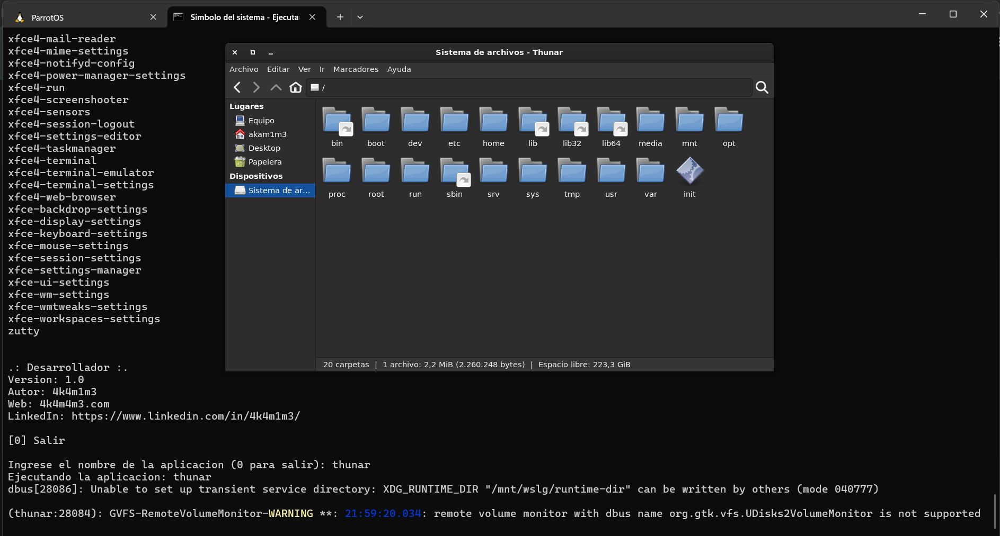

# EjecutarAplicacionesWSL.bat

**"Facilitando la ejecución de aplicaciones de Parrot OS desde WSL2 usando WSLg"**

## Historia

Trabajando actualmente con **Parrot OS en WSL2** me di cuenta de lo útil que puede ser ejecutar aplicaciones gráficas dentro de **Windows Subsystem for Linux** (WSL). Gracias a **WSLg**, podemos ejecutar aplicaciones gráficas de manera más sencilla y fluida, sin la necesidad de realizar configuraciones complejas.

Sin embargo, me encontré con que ejecutar estas aplicaciones no siempre es tan directo como parece. Por ello, desarrollé el script **EjecutarAplicacionesWSL.bat**, que permite listar todas las aplicaciones gráficas disponibles en **Parrot OS** (instaladas en WSL2) y ejecutarlas fácilmente con solo escribir su nombre. Esto ha simplificado enormemente mi flujo de trabajo, permitiéndome ejecutar cualquier herramienta de Parrot OS con solo teclear su nombre en una terminal de Windows.

Este script se convierte en una herramienta esencial para los usuarios de **Parrot OS en WSL2** que necesitan ejecutar aplicaciones de manera rápida y sin complicaciones.

## Funcionalidades

- **Lista automática de aplicaciones**: El script detecta automáticamente las aplicaciones instaladas en **Parrot OS** dentro de WSL2.
- **Ejecutar aplicaciones con un solo comando**: Con solo escribir el **nombre** de la aplicación, se ejecuta automáticamente, eliminando la necesidad de navegar por complejas rutas o ejecutar comandos largos.
- **No requiere configuración adicional**: Solo debes tener WSL2 y WSLg instalados, sin necesidad de instalar software adicional o configurar variables de entorno manualmente.
- **Interfaz de usuario sencilla**: El script presenta un listado claro de aplicaciones, donde puedes elegir por **nombre** para ejecutar la aplicación deseada.

## Ventajas

- **Rapidez**: Ejecuta cualquier aplicación de Parrot OS de manera inmediata con solo escribir su nombre.
- **Simplicidad**: Elimina la necesidad de recordar comandos largos o rutas complejas.
- **Fácil de usar**: Con solo ejecutar el archivo `.bat`, el usuario puede comenzar a usarlo de inmediato sin complicaciones.
- **Compatibilidad con WSLg**: Aprovecha la capacidad de **WSLg** para ejecutar aplicaciones gráficas directamente desde Parrot OS.

## Guía de Uso

### Requisitos previos

1. **Instalar WSL2 en tu máquina**.
2. **Instalar Parrot OS** dentro de **WSL2**.
3. **Habilitar WSLg** para soporte gráfico.

### Pasos para ejecutar el script

1. **Clonar o descargar este repositorio**:
    - Si tienes Git instalado en tu máquina, puedes clonar el repositorio:
      ```bash
      git clone https://github.com/tuusuario/EjecutarAplicacionesWSL.bat.git
      ```
    - O, simplemente **descargar** el archivo `.bat` directamente.

2. **Abrir el archivo** `EjecutarAplicacionesWSL.bat` en tu terminal de Windows:
    - Puedes hacer esto haciendo doble clic en el archivo o abriendo una terminal en la carpeta donde está ubicado el archivo y ejecutando:
      ```bash
      EjecutarAplicacionesWSL.bat
      ```

3. **Selecciona la aplicación**:
    - El script mostrará una lista de todas las aplicaciones disponibles en Parrot OS.
    - Ingresa **el nombre** de la aplicación que deseas ejecutar (por ejemplo, `thunar` o `terminator`).

4. **Ejecuta la aplicación**:
    - El script ejecutará la aplicación seleccionada automáticamente.

### Ejemplo de Uso:

1. El script mostrará una lista de aplicaciones disponibles en **Parrot OS**:

    ```
    ============================================
    Lista de Aplicaciones Disponibles
    ============================================
    terminator
    thunar
    firefox
    ...
    ```

2. Elige **el nombre** de la aplicación que deseas ejecutar. Por ejemplo, escribe `thunar` y el script abrirá el **gestor de archivos Thunar** inmediatamente.

## Captura de Pantalla



## Créditos

- **Autor**: 4k4m1m3
- **Web**: [4k4m1m3.com](https://4k4m1m3.com)
- **LinkedIn**: [Perfil de LinkedIn](https://www.linkedin.com/in/4k4m1m3/)

## Contribuciones

¡Este proyecto está abierto a mejoras y contribuciones! Si tienes alguna **sugerencia** o **propuesta de mejora**, no dudes en abrir un **issue** o enviar un **pull request**. 
